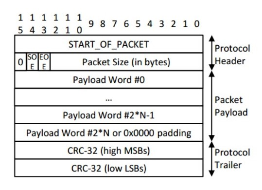
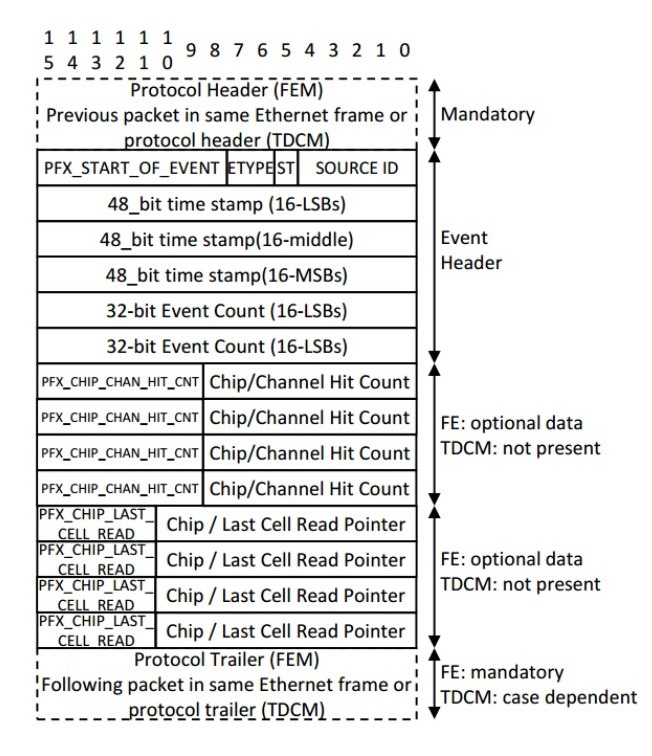
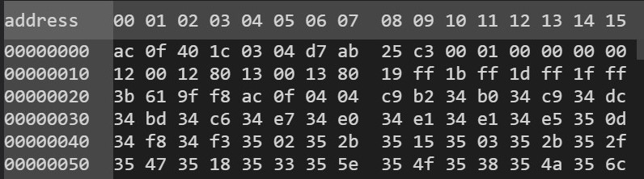
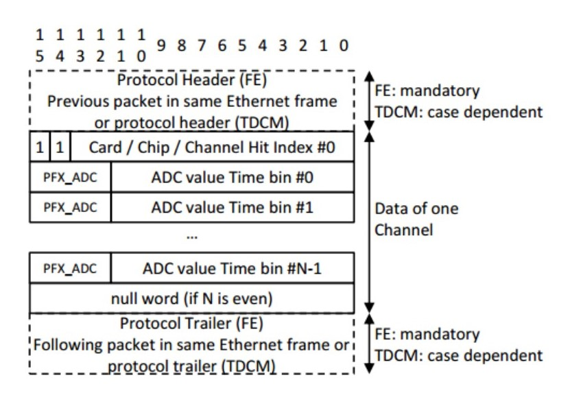
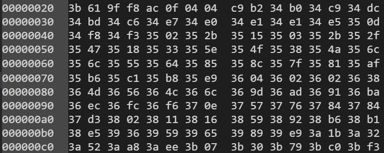
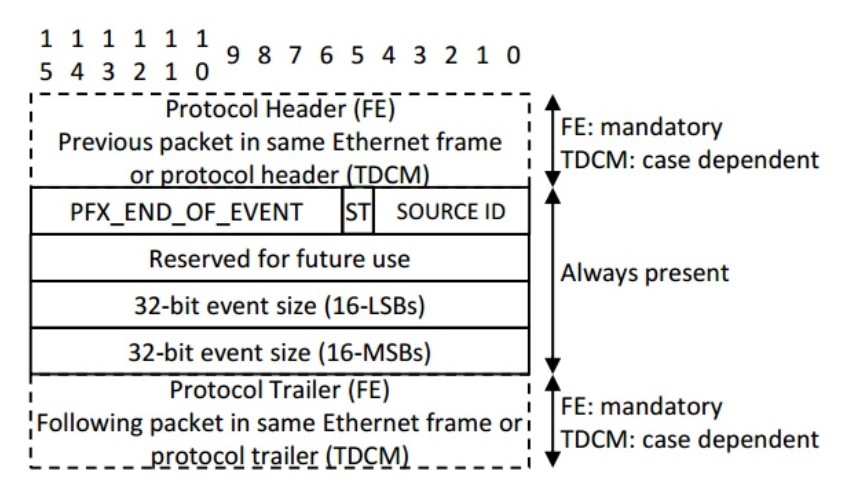
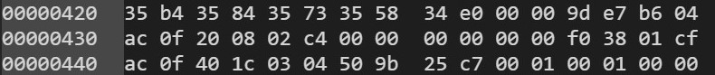

## 凡例和强制包头规定
```
hex: ac0f
bin: 1010 1100 0000 1111
```

<center>Event Packet</center>
<br/>

一个事件=事件头包+数据包+结束包\
An event = event header packet + event data packet + event end packet\
每个包（packet）都以0xac0f开始，之后跟随的是表征包的属性（头、数据还是结束）和大小的16位二进制数。
```
0 + SOE + EOE + packet size
```
0：头1位填充0;\
SOE：事件头包标志，1位；\
eoe：事件结束包标志，1位；\
头包：010...；数据包：000...；结束包：001...；\
packet size：13位。
## 事件头 Event Header
<center>


Event Header

<br/>
</center>

```
ac0f 401c
```
事件强制包头，(401c)<sub>16</sub> = (0100 0000 0001 1100)<sub>2</sub>，010... = 事件头。
```
0304
``` 
(0304)<sub>16</sub> = (0000 0011 0000 0100)<sub>2</sub>；\
(03)<sub>16</sub>是8位固定位(PFX_START_OF_EVENT)；中间3位用0填充(ETYPE and ST)；最后5位(SOURCE ID)写入FEC的ID，这里(00100)<sub>2</sub> = (4)<sub>16</sub> = (4)<sub>10</sub>，即意味着这一数据来源于ID为4的FEC board。
```
d7ab 25c3 0001
```
48位时间戳
```
0000 0000
```
32位事件计数(Event Count)\
除此之外的事件头中的数据没有使用。\
ps. 在数据获取中，很重要的就是大小和速度，这么多无用数据，应该于大小和速度都无益。
## 事件数据 Event Data
<center>


Event Data

<br/>
</center>

```
ac0f 0404
```
事件强制包头，(0404)<sub>16</sub> = (0000 0100 0000 0100)<sub>2</sub>，000... = 事件数据。
```
c9b2
```
(c9b2)<sub>16</sub> = (1100 1001 1011 0010)<sub>2</sub> = (11 00100 11 0110010)<sub>2</sub>，头2位是固定填充的(11)<sub>2</sub>，随后依次为board（5位）、chip（2位）、channel（7位）。(00100)<sub>2</sub> = (4)<sub>10</sub>，(11)<sub>2</sub> = (2)<sub>10</sub>，(0110010)<sub>2</sub> = (50)<sub>10</sub>，即说明此信号来自于4号FEC board的2号芯片的50通道。
```
34b0 34c9 34dc ...
```
0x3是填充的4位固定数(PFX_ADC)；之后的12位是来自AGET的512个单元的12位ADC数据。
## 事件结束 Event End
<center>


Event End

<br/>
</center>

```
ac0f 
```
强制协议头
```
2008
```
(0010 0000 0000 1000)<sub>2</sub>，前3位(001)<sub>2</sub> = 结束包。
```
02c4
```
(0000 0010 1100 0100)<sub>2</sub>，前10位(0000 0010 11)<sub>2</sub>是固定数据(PFX_END_OF_EVENT)，第11位(ST)填充0，最后4位(SOURCE_ID)是FEC的ID，这里是(0100)<sub>2</sub> = (4)<sub>10</sub>，代表ID = 4的FEC板子。
```
0000 0000 0000
```
32位事件大小表示当前事件的总大小，但现在它们被填充为0。
