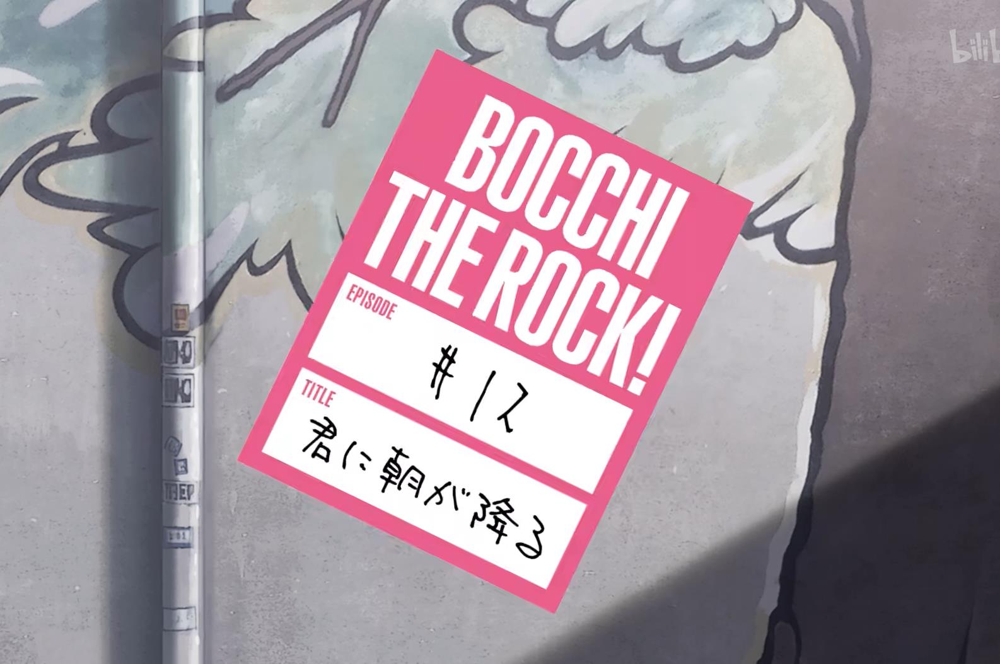

命运的钥匙 遗失在未知的荒原\
我们却仍然试图解开名为“未来”的谜团\
但是，谁又能说这些真诚的汗水抑或是泪水\
——其背后是徒劳或者一厢情愿\
\
黑暗的角落 我相信总有一天会照到\
那阴暗的狭缝中 也有米粒大小的苔花盛开\
谁又能说苔花的怒放 不如牡丹惊艳？\
\
愿共同迎来我们的黎明

<!-- 

 -->

<!-- 
愿你迎来黎明

  -->

<!-- >“愿你迎来黎明。” -->
